  

<h1 align="center">Hi 👋, I'm Maanik Agarwal</h1>
<h3 align="center">Data & Machine Learning Enthusiast | Builder of practical, hands-on tech</h3>

  
  

---

### 🚀 About Me

- 🔭 I'm currently working on **data-driven projects and machine learning models**
- 🧠 Interested in turning raw data into useful, real-world insights and applications
- 🏠 Also building a **custom smart mirror UI + offline voice assistant** from scratch (see featured project below)
- 🌱 Always learning — currently deepening my skills in ML pipelines, model deployment, and applied statistics
- ⚡ Fun fact: I like combining data work with hardware/IoT projects

---

### 🛠️ Tech Stack

**Languages**

**Data & ML**

**Tools & Platforms**

---

### 📌 Featured Project

#### 🪞 Custom Smart Mirror UI + Offline Voice Assistant
A from-scratch smart mirror frontend built to replace MagicMirror's default UI (not using MagicMirror's built-in modules).

- Built with a **Node/Express** backend and a browser-based frontend (developed and tested at `localhost:3000` before deploying to actual mirror hardware)
- Custom four-region dashboard layout: clock & date, live weather (via OpenWeatherMap, proxied through the backend), a time-aware greeting, and an upcoming events/calendar panel
- Paired with a **lightweight offline voice assistant** running on a **Raspberry Pi 4 (4GB)** — scoped intentionally to a fixed set of user-defined phrases/responses rather than open-ended conversation, keeping it fast and fully offline

---

### 📊 GitHub Stats

  
  

  

---

### 📫 Connect with Me

  <a href="https://www.linkedin.com/in/maanik-agarwal-" target="_blank">LinkedIn</a> •
  <a href="mailto:gargruchimay1984@gmail.com">Email</a>

<i>Thanks for stopping by! ⭐ Feel free to explore my repositories.</i>

